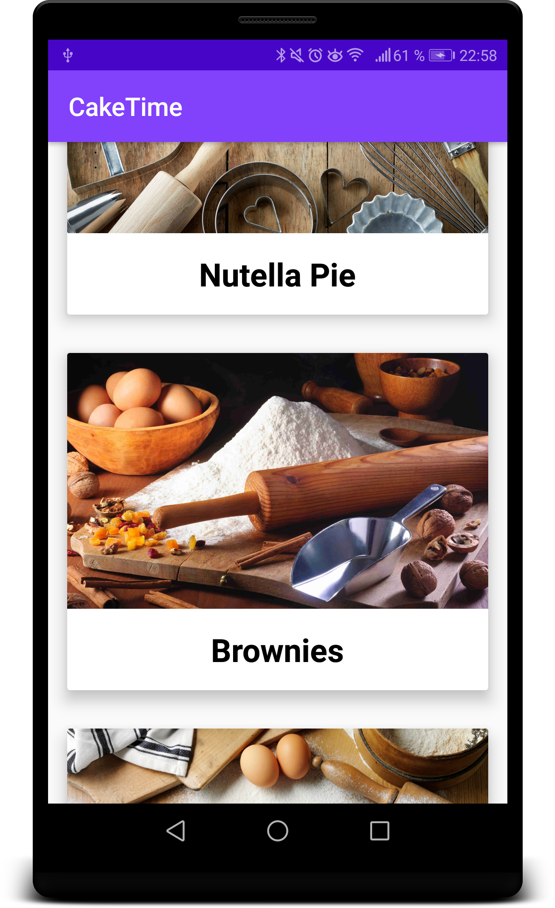
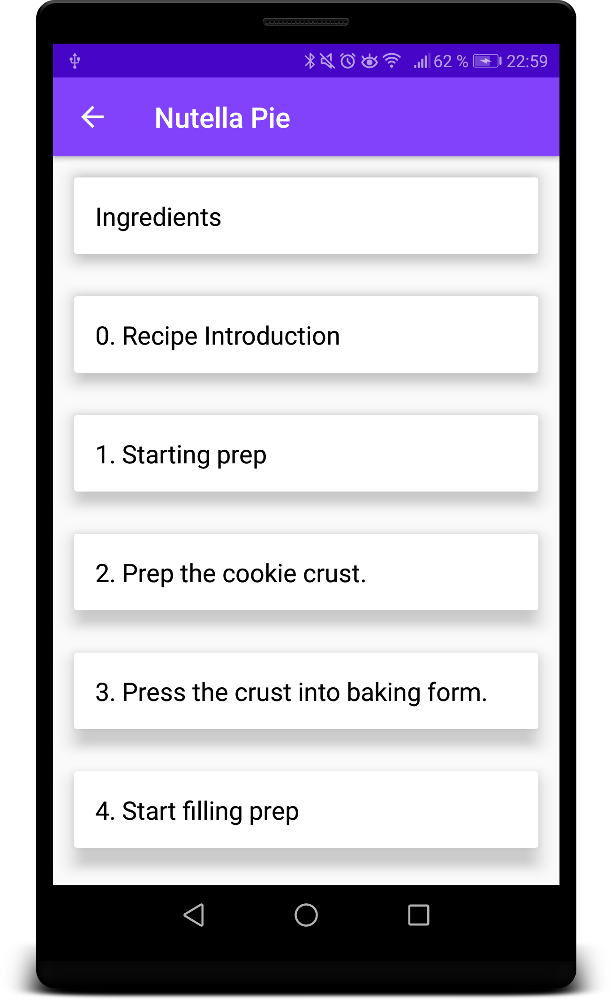
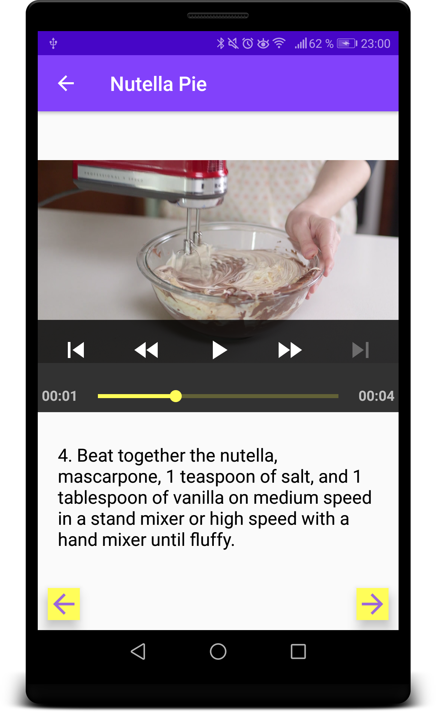
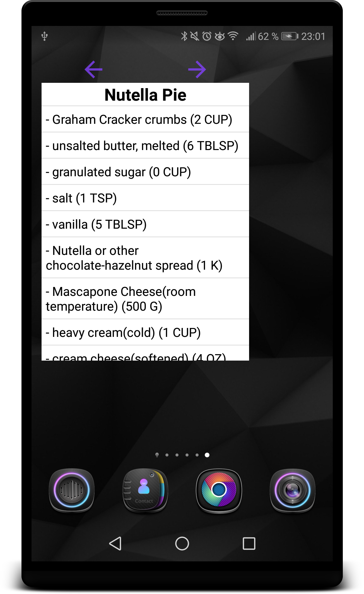

# CakeTime

CakeTime allows the user to view several baking recipes. The user can tap
on a recipe and view the ingredients list and the steps that are required.
Most steps not only contain written descriptions but also contain videos.

The app has an optimized UI for large screens (tablets, TVs etc.).
A widget makes it possible to view the ingredient lists of every recipe on
the home screen. 
The app requires an internet connection as the data is fetched from a server.

To get started just clone the repository and get the code running in Android Studio.

First the user can choose from a list of recipes:

Then the user can select to view either the ingredients list
or one of the recipe steps:

Next the detail screen shows the ingredients or the step description via
a text and/or a video:

The widget lets the user switch between the ingredients lists of all recipes.
That way the app hasn't to be in the foreground while shopping the
ingredients:

